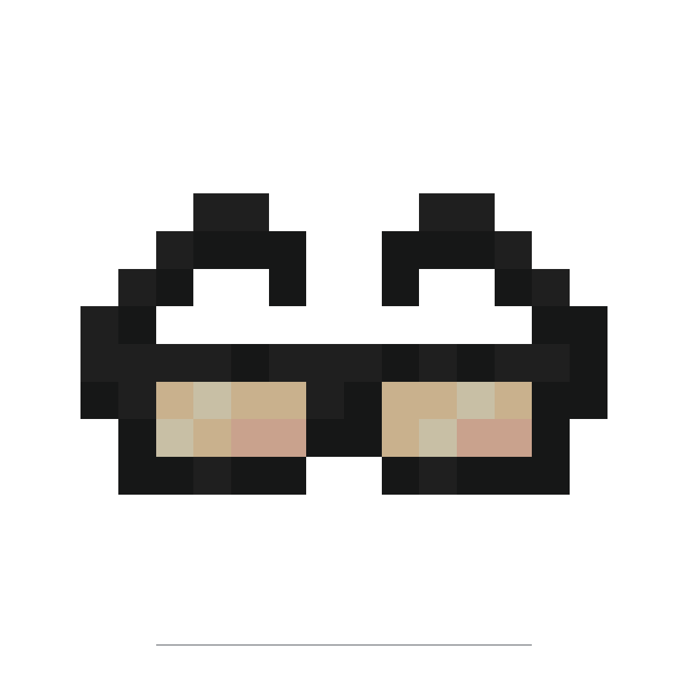

# Smart Glasses

!!! picture inline end
    { align=right }

The Smart Glasses can be used as an advanced pocket computer worn on the head,
equipped with most peripherials and various [modules](../modules)!

You can access Smart Glasses worn on the head via a [Smart Glasses Interface](./smart_glasses_interface.md).

---

## Module Peripheral

The `back` side peripheral on Smart Glasses can be used to access modules.  
[Modules](../modules) functions will be patched on the Module Peripheral.

```lua linenums="1"
local modules = peripheral.wrap('back')
print('Available modules:', table.unpack(modules.getModules()))
```

!!! note
    When modifing Smart Glasses modules, Module Peripheral will reload,
    which triggers [`peripheral_detach`](https://tweaked.cc/event/peripheral_detach.html)
    followed by [`peripheral`](https://tweaked.cc/event/peripheral.html) event.

### Functions

#### getModules
```
getModules() -> table
```

returns a list of installed modules' ID.

#### hasModule
```
hasModule(id: string) -> boolean
```

check if the module with given ID is installed.

---

## Changelog/Trivia

**0.8**  
Completely reworked AR Goggles and renamed it to Smart Glasses

**0.5b**  
Added the AR Controller and AR Goggles, made by Olfi01#6413
