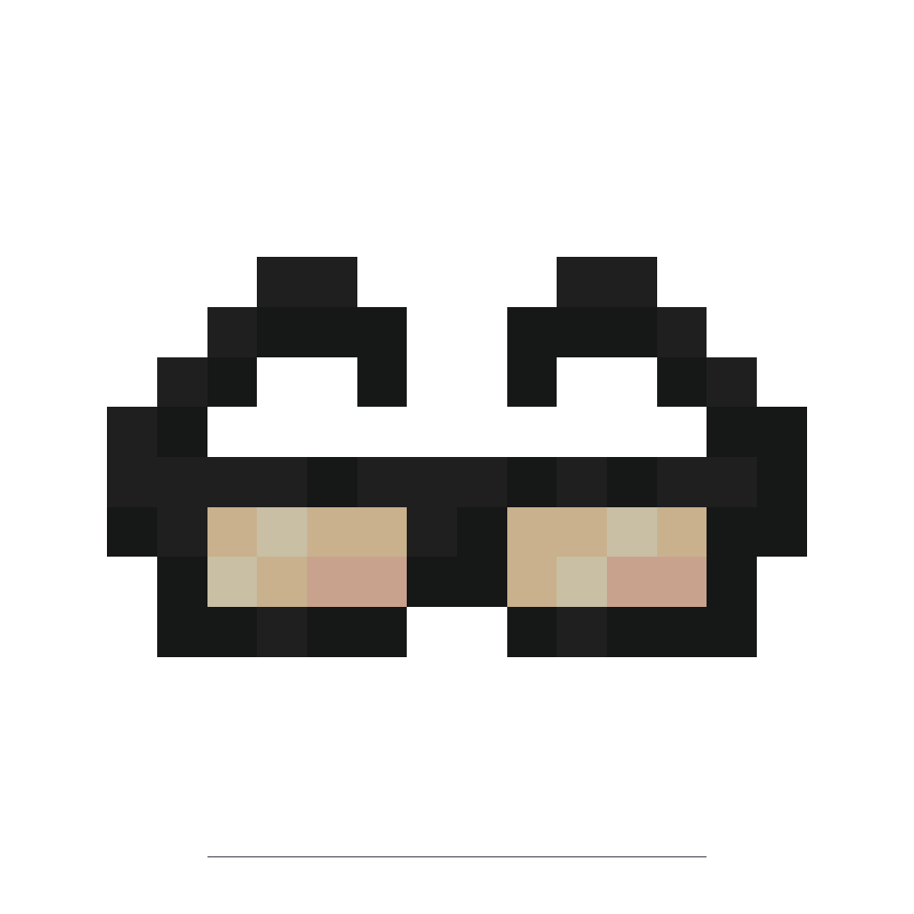

# Smart Glasses

!!! picture inline end
    { align=right }

The Smart Glasses can be used as an advanced pocket computer worn on the head,
equipped with most peripherials and various [modules](../modules/index.md)!

You can access Smart Glasses worn on the head via a [Smart Glasses Interface](./smart_glasses_interface.md).

`smartglasses` API exists and only exists on Smart Glasses. You may use it to detect if your script is currently running on a Smart Glasses.

---

## Functions

### isEquipped
```
isEquipped() -> boolean
```

check if the Smart Glasses is currently on an entity's head.

---

### getOwner
```
getOwner() -> table | nil
```

returns the wearer's entity data if the Smart Glasses currently have one.

---

## Changelog/Trivia

**0.8**  
Completely reworked AR Goggles and renamed it to Smart Glasses

**0.5b**  
Added the AR Controller and AR Goggles, made by Olfi01#6413
