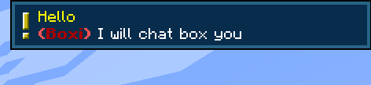
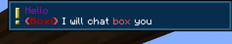

# Chat Box

!!! picture inline end
    { align=right }

The Chat Box is able to read and write messages to the in-game chat. You can send messages to just one player or to everyone.

!!! hint
    If you prefix your message with a $ the message will not be sent to the global chat but it will still fire the chat event.  
    Example:  
    `$this message is hidden!`

---

<center markdown>

| Peripheral Name | Interfaces with | Has events | Introduced in |
| --------------- | --------------- | ---------- | ------------- |
| chat_box        | Game Chat       | Yes        | 0.1b          |

</center>

---

## Events

### chat
Fires when a chat message appears within a chatbox's detection range.

**Values:**

1. `uuid: string` Message sender's UUID. `nil` if triggered from a /say command
2. `name: string` Message sender's name. `[say]` if triggered from a /say command
3. `message: string` The chat message
4. `isHidden: boolean` Whether or not the message is privately sent to chatboxes
5. `encodedUtf8Message: string` The encoded chat message from utf8

```lua linenums="1"
local event, uuid, username, message, isHidden = os.pullEvent("chat")
print("The 'chat' event was fired with the username " .. username .. " and the message " .. message)
```

!!! info
    The `chat` event will fire when a chatbox has been connected to a computer. You don't have to `.wrap()` or `.find()` the peripheral (unless you intend to send messages).

---

## Functions

### sendMessage
```
sendMessage(message: string, options: table | nil) -> true | nil, string
```

Broadcasts a message to the global chat or if `range` is specified it is sent to all players in the range.  
Returns true if the message is successfully sent, or nil and an error message if it fails.

`options` format:
```
{
    player: string | nil = message will only send to the player when specified
    utf8: boolean | nil = if strings and message should be treated as encoded utf8
    range: number | nil = the broadcast range
    prefix: string | nil = change the text that appears inside the brackets at the start of a message. Defaults to "AP".
    brackets: string | nil = used around the prefix. Must specify a two length string like "[]", "()", "<>", ...
    bracketColor: string | nil = specifies the color to use for the brackets, must be in the [MOTD code format](https://www.digminecraft.com/lists/color_list_pc.php).
}
```

Returns true if the message is successfully sent, or nil and an error message if it fails.

```lua linenums="1"
local chatBox = peripheral.find("chat_box")

chatBox.sendMessage("Hello world!") -- Sends "[AP] Hello world!" in chat
sleep(1) -- We must account for the cooldown between messages, this is to prevent spam
chatBox.sendMessage("I am dave", {prefix="Dave"}) -- Sends "[Dave] I am dave"
sleep(1)

-- Sends message "Welcome!" with cyan <> brackets around "<Box>"
-- to players within 30 blocks of the chat box
chatBox.sendMessage("Welcome!", {prefix="Box", brackets="<>", bracketColor="&b", range=30})

chatBox.sendMessage("Hello there.", {player="Player123"}) -- Sends "[AP] Hello there." to Player123 in chat
```

!!! tip
    Just like the `bracketColor` argument you can add colors to the `message` and `prefix` arguments using the same [MOTD color code format](https://www.digminecraft.com/lists/color_list_pc.php).  
    Since CC doesn't accept non-ascii charactor `§`, you should replace it with `&`.  
    If you want to send colored message but not only colored brackets, please use [`sendFormattedMessage()`](#sendformattedmessage) instead.

---

### sendFormattedMessage
```
sendFormattedMessage(json: string, options: table | nil) -> true | nil, string
```
This function is fundamentally the same as [`sendMessage()`](#sendmessage) except it takes a json text component as the first parameter.  
Find out more information on how the text component format works on the [minecraft wiki](https://minecraft.wiki/w/Text_component_format).
You can generate the json at [minecraft.tools](https://minecraft.tools/en/json_text.php?json=Welcome%20to%20Minecraft%20Tools).

```lua linenums="1"
local chatBox = peripheral.find("chat_box")

local message = {
    {text = "Click "},
    {
        text = "here",
        underlined = true,
        color = "aqua",
        clickEvent = {
            action = "open_url",
            value = "https://advancedperipherals.madefor.cc/"
        }
    },
    {text = " for the AP "},
    {text = "documentation", color = "red"},
    {text = "!"}
}

local json = textutils.serialiseJSON(message)

chatBox.sendFormattedMessage(json)
```

Since 1.21.1, `run_command` can no longer send chat message.  
You may use `/ap-chatbox` command to send message to all chatboxes. It will have equivalent effect than send `$` prefixed messages.

```lua linenums="1"
local message = {
    {
        text = "Click to say hi to all chatboxes!",
        underlined = true,
        clickEvent = {
            action = "run_command",
            value = "/ap-chatbox hi"
        }
    }
}

chatBox.sendFormattedMessage(textutils.serialiseJSON(message))
```

---

### sendToast
```
sendToast(options: table) -> true | nil, string
```
Sends a toast to the specified player. The design of the toast is the classic notification design. It's planned to add a custom rendered design in the future.



`options` format:
```
{
    message: string = the message in the toast
    title: string = the title of the toast
    player: string = player's name or uuid

    utf8: boolean | nil = if strings should be treated as encoded utf8
    prefix: string | nil = change the text that appears inside the brackets at the start of a message. Defaults to "AP".
    brackets: string | nil = used around the prefix
    bracketColor: string | nil = specifies the color to use for the brackets
}
```

```lua linenums="1"
local chatBox = peripheral.find("chat_box")

chatBox.sendToastToPlayer({
    message = "I will chat box you",
    title = "Hello",
    player = "Dev",
    prefix = "&4&lBoxi",
    brackets = "()",
    bracketColor = "&c&l",
})
```

---

### sendFormattedToast
```
sendFormattedToast(options: table) -> true | nil, string
```
This function is fundamentally the same as [`sendToast()`](#sendtoasttoplayer) except it takes a json text component for `message`, and `title` fields.  
Find out more information on how the text component format works on the [minecraft wiki](https://minecraft.wiki/w/Text_component_format).
You can generate the json at [minecraft.tools](https://minecraft.tools/en/json_text.php?json=Welcome%20to%20Minecraft%20Tools).



```lua linenums="1"
local chatBox = peripheral.find("chat_box")


local title = {
    { text = "Hello", color = "dark_purple"}
}

local message = {
    { text = "I will chat "},
    { text = "box ", color = "red"},
    { text = "you"}
}

local titleJson = textutils.serializeJSON(title)
local messageJson = textutils.serialiseJSON(message)

successful, error = chatBox.sendFormattedToast({
    message = messageJson,
    title = titleJson,
    player = "Dev",
    prefix = "&4&lBoxi",
    brackets = "()",
    bracketColor = "&c&l",
})
```

---

### narrateMessage
```
narrateMessage(message: string, options: table | nil) -> true | nil, string
```

Narrate the message to players around.

!!! warning
    Narration is based on individual player's system settings. People may hear different sounds and/or different speech speeds.
    The same word may also be pronounced differently, or may not be pronounced at all, depending on their system language.

`options` format:
```
{
    player: string | nil = message will only send to the player when specified
    utf8: boolean | nil = if strings should be treated as encoded utf8
    delay: boolean | nil = if the narrate message should queued after the previous narrations
}
```

```lua linenums="1"
local chatBox = peripheral.find("chat_box")

chatBox.narrateMessage("Hello world!")
chatBox.narrateMessage("Say hi to Dev only", {
    player = "Dev",
})
```

---

## Changelog/Trivia

**0.8**  
Added `narrateMessage`.  
Merged `sendMessageToPlayer` variant to `sendMessage` by specific `player` option value.

**1.19.2-0.7.33r/1.20.1-0.7.37r**  
Added `sendToastToPlayer` and `sendFormattedToastToPlayer`

**0.7r**  
Added the `uuid` and `isHidden` parameter to the **chat** event. Also added the `sendFormattedMessage` function.

**4.0b**  
Fixed the chat box so that is should now work in LAN worlds

**0.1b**  
Added the chat box. This was the first feature of the mod.
