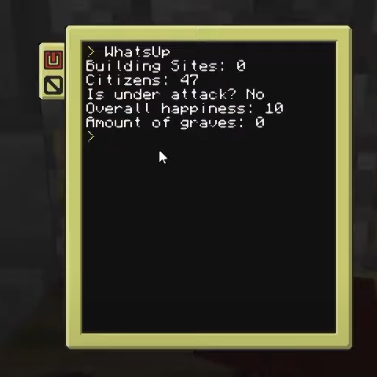

# Colony Integrator

!!! picture inline end
    { align=right }

The colony integrator can interact with a colony from MineColonies.

!!! warning "Requirement"
    Requires the [MineColonies](https://www.curseforge.com/minecraft/mc-mods/minecolonies) mod to be installed

<p class="picture-spacing" style="--ps:1.9rem;"></p>

---

<center markdown>

| Peripheral Name   | Interfaces with | Has events | Introduced in |
| ----------------- | --------------- | ---------- | ------------- |
| colony_integrator | Mine Colony     | No         | 0.7r          |

</center>

---

## Functions

### isInColony
```
isInColony() -> boolean
```
Returns true if the block is in a colony.

```lua linenums="1"
local integrator = peripheral.find("colony_integrator")

if integrator.isInColony() then
    print("Block is inside a colony!")
else
    print("Not in a colony!")
end
```

---

### isWithin
```
isWithin(position: table) -> boolean
```
Returns true if the given coordinates are in a colony.

The `position` table must be a valid [position object][position_object].

---

### amountOfConstructionSites
```
amountOfConstructionSites() -> number
```
Returns the current number of active construction sites.

---

### getColonyID
```
getColonyID() -> number
```
Returns the id of the colony.

---

### getColonyName
```
getColonyName() -> string
```
Returns the name of the colony.

---

### getColonyStyle
```
getColonyStyle() -> string
```
Returns the style of the colony. For a list of different colony styles [click here](https://minecolony.fandom.com/wiki/Building_Styles).

---

### isActive
```
isActive() -> boolean
```
Returns true if the colony is active. This is true when trusted players are online.

---

### getLocation
```
getLocation() -> table
```
Returns the [position][position_object] of the townhall.

---

### getHappiness
```
getHappiness() -> number
```
Returns the overall happiness of the colony.

---

### isUnderAttack
```
isUnderAttack() -> boolean
```
Returns true if the colony is currently under attack.

---

### isUnderRaid
```
isUnderRaid() -> boolean
```
Returns true if the colony is currently under a raid.

---

### getCitizenCount
```
getCitizenCount() -> number
```
Returns the number of citizens in the colony.

---

### getCitizenLimit
```
getCitizenLimit() -> number
```
Returns the maximum number of citizens the colony can currently hold.

---

### getGraveCount
```
getGraveCount() -> number
```
Returns the current number of graves.

---

### getCitizens
```
getCitizens() -> table
```

Returns a list of information about every citizen in the colony.

#### Citizen Properties

| Citizen                | Description                                             |
| ---------------------- | ------------------------------------------------------- |
| id: `string`           | The citizen's ID                                        |
| uuid: `string`         | The citizen's UUID                                      |
| name: `string`         | The citizen's name                                      |
| isChild: `boolean`     | If the citizen is a child                               |
| gender: `string`       | The citizen's gender, either "male" or "female"         |
| saturation: `number`   | The citizen's food saturation                           |
| happiness: `number`    | An indicator of how happy the citizen is                |
| skills: `table`        | A table of skill names to skills where each skill has<br>a `level` and `xp` number |
| disease: `string?`     | The citizen's current disease                           |
| bedPos: `table`        | The position of the citizen's bed (has `x`, `y`, `z`)   |
| pos: `table`           | The current location of the citizen (has `x`, `y`, `z`) |
| workBuilding: `table?` | A table of info about the citizen's workplace           |
| homeBuilding: `table?` | A table of info about the citizen's house               |
| state: `string`        | A string representing the citizen's current state       |
| isIdle: `boolean`      | If the citizen is currently idle                        |
| isAsleep: `boolean`    | If the citizen is currently asleep                      |
| isMourning: `boolean`  | If the citizen is currently mourning                    |
| needsBetterFood: `boolean` | Whether the citizen needs better food               |
| partener: `number?`    | The citizen't partener's ID, if exists                  |
| children: `table`      | A list of the ids of this citizen's children            |
| health: `number?`      | The citizen's current health                            |
| maxHealth: `number?`   | The citizen's max health                                |
| armor: `number?`       | The citizen's current number of armor points            |
| toughness: `number?`   | The citizen's armor toughness                           |

#### Building Properties

| Building              | Description                  |
| --------------------- | ---------------------------- |
| pos: `table`          | The building [position][position_object] |
| type: `string`        | The building type            |
| level: `number`       | The building's level         |
| displayName: `string` | The building's display name  |

#### Work Building Properties

Extends [Building Properties](#building-properties)

| Work Building     | Description       |
| ----------------- | ----------------- |
| job: `string`     | The id of the job |

---

### getCitizen
```
getCitizen(id: number) -> table | nil
```

Returns information of a citizen in the colony.

See [Citizen Properties](#citizen-properties)

---

### getVisitors
```
getVisitors() -> table
```
Returns a list of information about all of the visitors in your colony's tavern.

#### Visitor Properties
| Visitor                | Description                                                   |
| ---------------------- | ------------------------------------------------------------- |
| id: `string`           | The citizen's ID                                              |
| uuid: `string`         | The citizen's UUID                                            |
| name: `string`         | The citizen's name                                            |
| isChild: `boolean`     | If the citizen is a child                                     |
| gender: `string`       | The citizen's gender, either "male" or "female"               |
| saturation: `number`   | The citizen's food saturation                                 |
| happiness: `number`    | An indicator of how happy the citizen is                      |
| skills: `table`        | A table of skill names to skills where each skill has<br>a `level` and `xp` number |
| disease: `string?`     | The citizen's current disease                                 |
| recruitCost: `table`   | The [items][item_stack_object] needed to recruit this visitor |

---

### getBuildings
```
getBuildings() -> table
```
Returns a list of details about every building in the colony.

#### Building Properties
| building                | Description                                       |
| ----------------------- | ------------------------------------------------- |
| pos: `table`            | The buildings's [location][position_object]       |
| type: `string`          | The building type                                 |
| level: `number`         | The building's level                              |
| displayName: `string`   | The name of the building                          |
| style: `string`         | The building's style                              |
| maxLevel: `number`      | The building's max level                          |
| built: `boolean`        | If the building is built or is under construction |
| isWorking: `boolean`    | Whether the building is being worked on           |
| priority: `number`      | The building's construction priority              |
| structure: `table`      | A table defining the bounds of the structure      |
| citizens: `table`       | A list of citizen's `name`s and `id`s             |
| storageBlocks: `number` | The number of storage blocks in the building      |
| storageSlots: `number`  | The number of storage slots                       |
| guarded: `boolean`      | If the building is currently being guarded        |

#### Structure Properties
| structure          | Description                                        |
| ------------------ | -------------------------------------------------- |
| cornerA: `table`   | The first [corner][position_object] of the bounds  |
| cornerB: `table`   | The second [corner][position_object] of the bounds |
| rotation: `string` | The structure's rotation enum                      |
| mirror: `boolean`  | If the structure has been mirrored                 |

---

### getWorkOrders
```
getWorkOrders() -> table
```
Returns a list of active work orders in the colony.

#### Work Order Properties
| Work Order              | Description                                     |
| ----------------------- | ----------------------------------------------- |
| id: `string`            | The work order's id                             |
| pos: `table`            | The work order's [location][position_object]    |
| type: `string`          | The type of work order                          |
| displayName: `string`   | The name of work order                          |
| priority: `number`      | The priority of the work order                  |
| level: `number`         | The work's current progress                     |
| targetLevel: `number`   | The work's target level                         |
| stage: `string`         | The work's current stage                        |
| isClaimed: `boolean`    | Whether the work order has been claimed         |
| builderHome: `table?`   | The builder's home (only if claimed)            |

---

### getResearch
```
getResearch() -> table
```

Returns a table of all possible colony research as a tree where the root table contains the branch names and their respective research.

#### Research Properties
| Research                 | Description                                |
| ------------------------ | ------------------------------------------ |
| id: `string`             | The research id                            |
| displayName: `string`    | The name of the research                   |
| requirements: `table`    | List of requirements for the research      |
| cost: `table`            | The cost of the research (list of tables)  |
| researchEffects: `table` | A list of effects provided by the research |
| status: `number`         | The current research status                |
| requiredTime: `number`   | The base research ticks                    |
| progress: `number`       | Research progress                          |
| children: `table?`       | A list of any child research               |

#### Requirement Properties
| Requirememt          | Description                                    |
| -------------------- | ---------------------------------------------- |
| type: `string`       | Type of requirement.                           |
| desc: `string`       | Description of the requirement                 |
| fulfilled: `boolean` | If the requirement is already met              |

##### Building Requirement Properties
If the requirement type is `minecolonies:building`, it will have these additional properties:

| requirememt          | Description                     |
| -------------------- | ------------------------------- |
| building: `string`   | Name of the required building   |
| level: `number`      | Level of the required building  |

##### Alternate Buildings Requirement Properties
If the requirement type is `minecolonies:alternate-building`, it will have these additional properties:

| requirememt          | Description                     |
| -------------------- | ------------------------------- |
| buildings: `table`   | List of the required buildings  |
| level: `number`      | Level of the required buildings |

#### Cost Items Properties
| Cost Items             | Description                               |
| ---------------------- | ----------------------------------------- |
| validItems: `table`    | The valid [items][item_stack_object] list |
| count: `number`        | The amount of the item                    |

---

### getWorkOrderResources
```
getWorkOrderResources(workOrderId: number) -> table | nil
```
Returns a list of all of the required resources for a work order. Or nil if the work order does not exist.

#### Properties
| resource              | Description                                     |
| --------------------- | ----------------------------------------------- |
| item: `string`        | The registry name for the item                  |
| displayName: `string` | The display name for the item                   |
| status: `string`      | The status of this resource                     |
| needed: `number`      | How much of the resource is needed for the job  |
| available: `boolean`  | If the resource is currently available          |
| delivering: `boolean` | If the resource is currently being delivered    |

---

### getBuilderResources
```
getBuilderResources(position: table) -> table | nil
```
Returns the resources required by the given builder's hut.

The `position` table must be a valid [position object][position_object].

---

### getRequests
```
getRequests() -> table
```
Returns a list of the colonies current requests.

#### Request Properties
| request            | Description                                |
| ------------------ | ------------------------------------------ |
| id: `string`       | The request's id                           |
| name: `string`     | The name of the request                    |
| desc: `string`     | A description about the request            |
| state: `string`    | The state of the request                   |
| count: `number`    | The number of the request                  |
| minCount: `number` | The minimum of the request needed          |
| target: `string`   | The request's target                       |
| items: `table`     | A list of items attached to the request    |

#### Item Properties

| item                   | Description                             |
| ---------------------- | --------------------------------------- |
| name: `string`         | The registry name of the item           |
| count: `number`        | The amount of the item                  |
| maxStackSize: `number` | Maximum stack size for the item type    |
| displayName: `string`  | The item's display name                 |
| tags: `table`          | A list of item tags                     |
| nbt: `table`           | The item's nbt data                     |

---

## Examples

### Citizen Monitor

We made a script to show every citizens and their gender on a monitor.

You can view and download the script on [Github](https://github.com/SirEndii/Lua-Projects/blob/master/Examples/colony_integrator_list.lua)


### Colony Stats

And here we have a script made for a pocket computer to show statistics about a colony.

You can view and download the script on [Github](https://github.com/SirEndii/Lua-Projects/blob/master/Examples/colony_integrator_status.lua)


---

## Changelog/Trivia

**0.7r**  
Added the colony integrator

[position_object]: ../guides/lua_objects.md#position
[item_stack_object]: ../guides/lua_objects.md#item-stack
