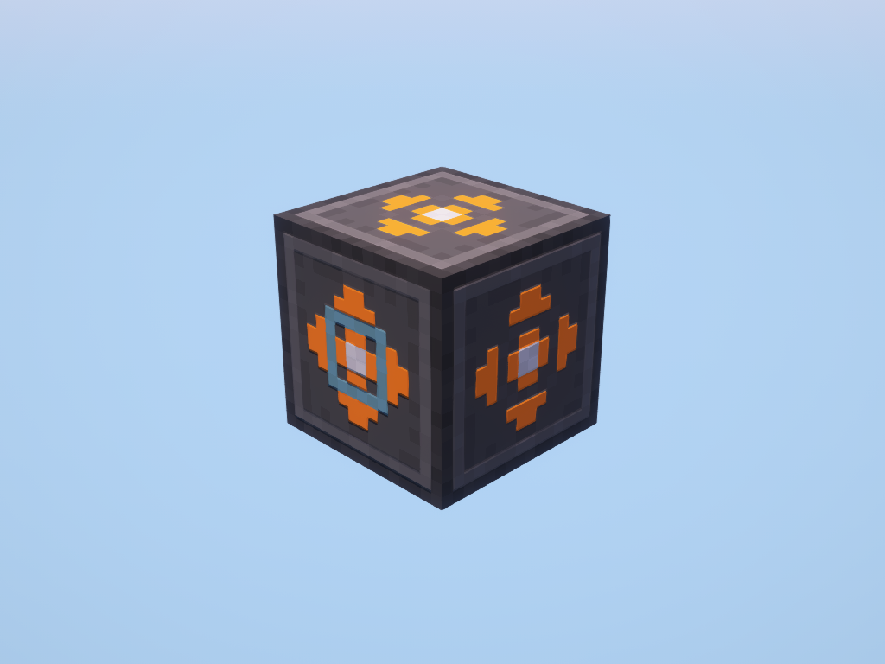

# Geo Scanner

!!! picture inline end
    { align=right }

The Geo Scanner provides information about blocks around it and the chunk of that it is in.

The Geo scanner has a delay between scans, so you must wait until you can scan again.

<p class="picture-spacing" style="--ps:3.9rem;"></p>

---

<center markdown>

| Peripheral Name | Interfaces with | Has events | Introduced in |
| --------------- | --------------- | ---------- | ------------- |
| geo_scanner     | Blocks          | No         | 0.7r          |

</center>

---

## Functions

### getFuelLevel
```
getFuelLevel() -> number
```

Returns the amount of stored fuel.

---

### getMaxFuelLevel
```
getMaxFuelLevel() -> number
```

Returns the maximum amount of possible stored fuel.

---

### scanBlocks
```
scanBlocks(radius: number) -> table | (nil, string)
```

Returns a list of data about all blocks in the radius. Or if the scan fails it returns nil and an error message.

#### Block Properties

| block          | Description                         |
| -------------- | ----------------------------------- |
| name: `string` | The registry name of the block      |
| tags: `table`  | A list of block tags                |
| state: `table` | The block states                    |
| x: `number`    | The block's relative x coordinate   |
| y: `number`    | The block's relative y coordinate   |
| z: `number`    | The block's relative z coordinate   |
| f: `number`    | The block's relative front distance |
| r: `number`    | The block's relative right distance |
| u: `number`    | The block's relative up distance    |

---

### chunkAnalyze
```
chunkAnalyze(filter: string | nil) -> table | (nil, string)
```

Returns a table of data about how many of each ore type is in the block's chunk. Or if the analyze fails it returns nil and an error message.

`filter` can be a block id, or a block tag starts with `#`

---

## Changelog/Trivia

**0.7r**  
Added Geo Scanner peripheral.
