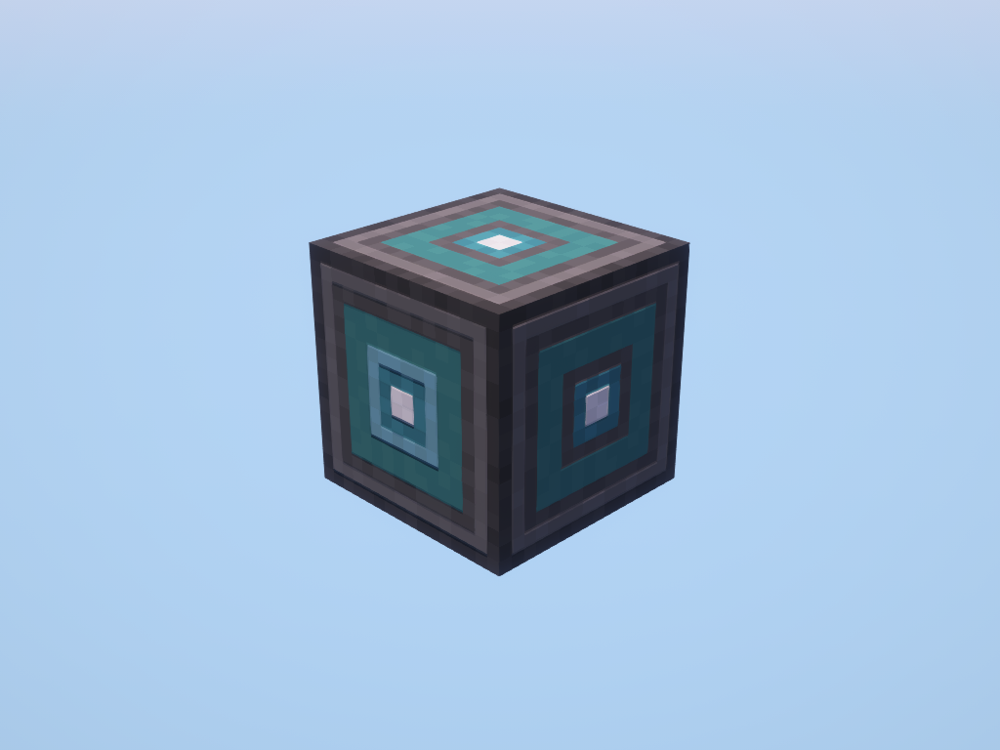

# Inventory Manager

!!! picture inline end
    { align=right }

The Inventory Manager can communicate with the player's inventory. You need to assign yourself to a [Memory Card](../items/memory_card.md) and put the card into the manager to use it.

!!! note
    Only one Memory Card can be used per Inventory Manager.

<p class="picture-spacing" style="--ps:0.6rem;"></p>

---

<center>

| Peripheral Name   | Interfaces with  | Has events | Introduced in |
| ----------------- | ---------------- | ---------- | ------------- |
| inventory_manager | Player Inventory | No         | 0.5b          |

</center>

---

!!! failure
    <center> <h3> You need to place the inventory you want to use next to the inventory manager and **NOT** next to the computer! <h3> </center>

## Functions

### getOwner
```
getOwner() -> string, string | nil
```

Returns the uuid and the username of the owner of the memory card in the manager.
Returns `nil` if there is no memory card or owner is offline.

---

### size
```
size() -> number
```

Returns the size of the player's inventory.

---

### getCuriosSizes
```
getCuriosSizes() -> table
```

!!! warning "Requirement"
    Requires the Curios API mod to be installed

Returns the sizes of the player's curios inventory.

Result format:
```
{
    [<slot name>]: string = <slot count>: number
}
```

---

### list
```
list() -> table
```

Returns the contents of the player's inventory as a map of `slot` -> `item`.

#### Item Properties

| item                   | Description                             |
| ---------------------- | --------------------------------------- |
| name: `string`         | The registry name of the item           |
| count: `number`        | The amount of the item                  |
| maxStackSize: `number` | Maximum stack size for the item type    |
| displayName: `string`  | The item's display name                 |
| tags: `table`          | A list of item tags                     |
| components: `table`    | The item's component data               |

---

### listCurios
```
listCurios() -> table
```

!!! warning "Requirement"
    Requires the Curios API mod to be installed

Returns the contents of the player's curios inventory.

Result format:
```
{
    [<slot name>]: string = {
        [<slot>]: number = <item>: table
    }
}
```

---

### pushItems
```
pushItems(toName: string, filter: table) -> number
```

Removes items from the player's inventory and returns the amount of the item removed.

`toName` is the target inventory's peripheral name.
`filter` is an item filter to define how to move items.

!!! tip
    You can use both relative (`@right`, `@left`, `@front`, `@back`, `@top`, `@bottom`) and cardinal (`@north`, `@south`, `@east`, `@west`, `@up`, `@down`) directions for the `toName` argument to refer to an inventory directly relative to the inventory manager block.

```lua linenums="1"
local manager = peripheral.find("inventory_manager")

-- Remove up to 5 of the item in slot 1 of the player's inventory
-- and place it in the block above
manager.pushItems("@up", {name="minecraft:cobblestone", toSlot=3, fromSlot=1, count=5})
```

---

### pushCuriosItems
```
pushCuriosItems(slotName: string, toName: string, filter: table) -> number
```

Removes items from the player's curios inventory and returns the amount of the item added.

---

### pullItems
```
pullItems(fromName: string, filter: table) -> number
```

Adds items to the player's inventory and returns the amount of the item added.

`fromName` is the source inventory's peripheral name.
`filter` is an item filter to define how to move items.

```lua linenums="1"
local manager = peripheral.find("inventory_manager")

-- Add 32 cobblestone to the players offhand slot from the block above
manager.pullItems("@up", {name="minecraft:cobblestone", toSlot=36, count=32})
```

---

### pullCuriosItems
```
pullCuriosItems(slotName: string, fromName: string, filter: table) -> number
```

Adds items from the player's curios inventory and returns the amount of the item added.

---

### wrapStorageItem
```
wrapStorageItem(slot: number) -> table
```

Returns the wrapped operations of a storage item (e.g. backpack, bucket).

#### Wrapped Operations

| Operation                   | Description                                            |
| --------------------------- | ------------------------------------------------------ |
| `isValid(): boolean`        | If other operations are still valid to perform.        |
| `isItemStorage(): boolean`  | If item operations are valid to perform on this item.  |
| `isFluidStorage(): boolean` | If fluid operations are valid to perform on this item. |

| Item operation                                   | Description                                                  |
| ------------------------------------------------ | ------------------------------------------------------------ |
| `size(): number`                                 | Returns the inventory size of the storage item.              |
| `list(): table`                                  | List the available item in the storage item.                 |
| `pushItems(name: string, filter: table): number` | Push items from the storage item to an inventory peripheral. |
| `pullItems(name: string, filter: table): number` | Pull items from an inventory peripheral to the storage item. |

| Fluid operation                                  | Description                                                     |
| ------------------------------------------------ | --------------------------------------------------------------- |
| `tanks(): table`                                 | List the available tanks in the storage item.                   |
| `pushFluid(name: string, filter: table): number` | Push fluid from the storage item to a fluid storage peripheral. |
| `pullFluid(name: string, filter: table): number` | Pull fluid from a fluid storage peripheral to the storage item. |

---

### wrapCuriosStorageItem
```
wrapCuriosStorageItem(slotName: number, slot: number) -> table
```

Returns the wrapped operations of a storage item (e.g. backpack, bucket) in curios inventory.

---

### isWearing
```
isWearing(armorIndex: number) -> boolean
```

Returns true if the player is wearing a armor piece on the given slot.  
Armor index: `4`(Helmet) - `1`(Boots).

---

### getEmptySlots
```
getEmptySlots() -> number
```

Returns the number of empty slots in the player's inventory.

---

### getFreeSlot
```
getFreeSlot() -> number
```

Returns the next free slot in the player's inventory. Or `0` if their inventory is full.

---

### getHandSlot
```
getHandSlot() -> number
```

Returns the player's selected slot.

---

### getItemInHand
```
getItemInHand() -> table
```

Returns the item in the player's main hand.

---

### getItemInOffHand
```
getItemInOffHand() -> table
```

Returns the item in the player's off hand.

---

## Changelog/Trivia

**0.7.4r**  
Added `getItemInHand`, `getItemInOffHand`, `getFreeSlot`, `isSpaceAvailable` and `getEmptySpace` to the inventory manager.  
Added support for armor items, you can use the slots `100 - 103` to access armor items.

**0.7r**  
Added the `slot` parameter.  
Also changed the direction parameter to computercraft directions.

**0.5.2b**  
Fixed the bug where the inventory manager does not drop its contents.

**0.5b**  
Added the Inventory Manager and Memory Card
