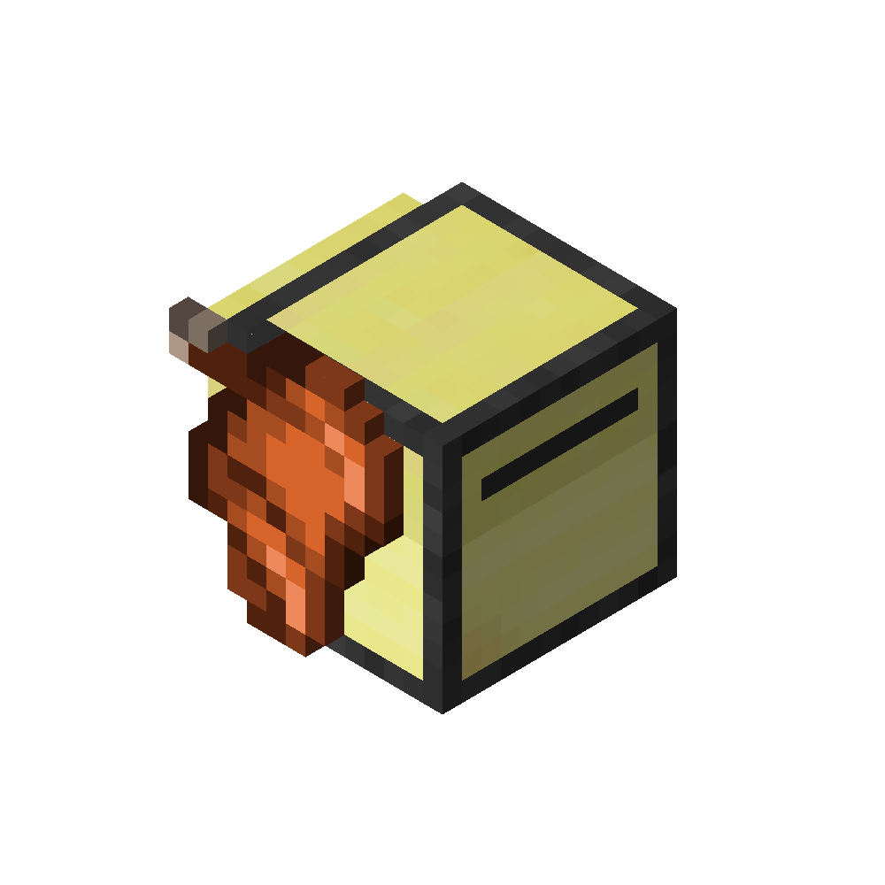

# Saddle Turtle

!!! picture inline end
    { align=right }

The Saddle Turtle allow you to capture an entity or a player on to the turtle.

<p class="picture-spacing" style="--ps:6.3rem;"></p>

---

## Functions

---

### capture
```
capture() -> true | (nil, string)
```

Capture an entity / player in front of the turtle.

---

### release
```
release() -> true | (nil, string)
```

Release the current rider from the turtle.

---

### hasRider
```
hasRider() -> boolean
```

Check if the turtle has a rider.

---

### getRider
```
getRider(detailed: boolean) -> table | (nil, string)
```

Get the rider's information.

---

## Changelog/Trivia

**0.8**  
Added the Saddle Turtle
